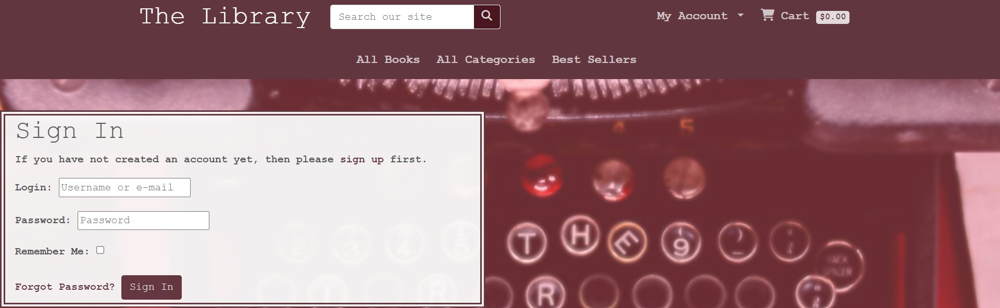
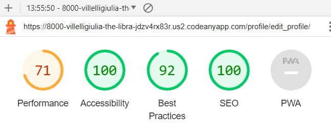
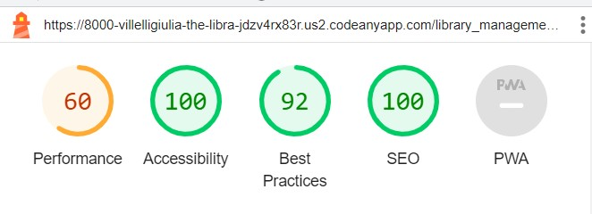
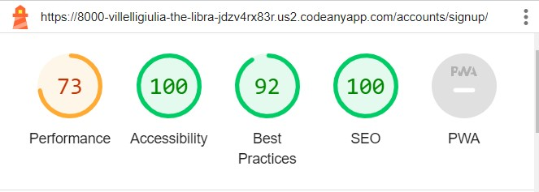

# The Library

The Library, a Heroku-hosted e-commerce platform, is an online bookstore dedicated to the world of reading. Designed for book lovers and avid readers, this responsive website provides a diverse collection of books across genres and authors, fostering literary exploration and discovery. Within its virtual shelves, users can engage with books through detailed descriptions, ratings, and reviews, creating a sense of community among readers. Seamlessly integrated with a user-friendly shopping experience, The Library offers best offers and bestsellers for discerning readers. Behind the scenes, an admin dashboard empowers efficient library management. With a newsletter subscription section and a link to a dedicated Facebook page, The Library aims to connect and engage its audience. It is a literary hub, welcoming all who cherish the written word to embark on a journey of literary delight.

[Here](https://the--library-3ca77daf8ee2.herokuapp.com/) is a live view of the project.

## Features

The Library is an online bookstore designed for ease and efficiency. The landing page, like a virtual bookshelves offers a wide range of books for users to explore. Users can easily filter books by title, category, or author, simplifying the search process. The site features two navigation bars: one for essential functions like a search bar.  account management, including registration, login and access to profile, where user can store profile info available for future checkout;  library management section for admin user only, providing administrators with book-related tasks like adding, editing, and deleting books.It also includes a cart where users can add book to it, review order and costs,continue shopping or proceed with the checkout process. The second navbar offers sections for all books, categories, and best sellers, including special offers. Additionally, links to a Facebook page and a newsletter subscription combining user-friendly exploration with convenience.The website comes also with a customized 404 page where the user gets redirected to if by any reason ends up on an inexistent page within the web si and that guides the user in an easy way to go back to the main page"

### Navbars and footer

The navigation bars and footer provide a consistent presence across almost every page of the website. This design choice ensures a seamless and user-friendly experience, allowing easy access to essential features. Users will find these elements consistently available throughout the site, except on pages related to the authentication process and the 404 error page, maintaining a sense of familiarity and ease of navigation."

 

- The first nav bar is placed on top of the page. It consist of :
  - "The Library" link : title and name of the bookstore, is a linkable heading which redirects to the main page when clicked.
  - Main search bar: the user will be able to filter the books in the library. By entering keywords such as book titles, author names, or categories, users can conduct detailed searches, simplifying the process of finding their desired content. The search bar efficiently retrieves search results, presenting users with relevant books, or when necessary, informative messages, guiding users when there are no matching results or invalid inputs.
  - "My Account" dropdown link : in this section, the user will have access to authentication system. If logged out or unregistered, the "Login" and "Register" link will be displayed. Although the user would be able to navigate the site, searching for books, or looking for book details, best offers, best sellers, adding books to cart etc, withouth being authenticated, the user will be asked to do so to access more usefull and advanced features such as proceed with the checkout process, leaving book reviews and access to user profile info, where the user could store iformation details for future checkout. The Profile will be then shown in the "My Account" dropdown when the user is logged in. If logged in a "Library Management" link will be also displayed in this section, with the additional condition of the user being admin of the website. The "Library Management" link will give access to an admin-like page, where whoever has access to it, will have direct control of the Library and be able to perform actions such as create a new book, edit or delete an exiting one.

- Cart : the Cart link will be found on the top right hand side of the navbar, together with a cart icon and the dollar amount of the cart content.

  - Placed below the main nav bar, the second navbar is about book related section. It consists of three links placed in the center of the width of the navbar:
  - All Books : ie the landing page, a virtual bookshelve , where the user has visibility of all the books of the library.
  - All Categories: here the user will see all the books grouped by category.
    - Best Seller : in this section the user will be able to see Best offers books ie books with lowest price among the Library and the Best sellers, which are the books with the highest rating.

- On responsive devices the two navbars collapse into 2 different dropdown menu,represented by an info icon for the main nav bar and a book icon for the second one.

- The footer is a concise yet valuable section that includes two significant elements. Firstly, it provides users with a direct link to ['The Library's](https://www.facebook.com/profile.php?id=61551466252534)official Facebook page, enhancing the platform's social engagement. Secondly, it features a user-friendly newsletter subscription mechanism, seamlessly integrated with [Mailchimp](https://mailchimp.com/), enabling readers to subscribe for updates and exclusive offers.

### Book list landing page

The Book List Page serves as the landing point for users, a virtual bookshelf. Upon arrival, users are greeted with a introductory image of a typewriter, which encapsulates the website's theme also seen in the typewriting effect for all displayed messages throughout the website navigation. This page presents a diverse collection of books across various categories. Each book is showcased with its cover image, accompanied by essential details such as category, price, and rating. To explore a book further, users can click the 'View Book Details' button and navigate to dedicated page for more details about the selcted book.

### The Book Detail Page

This page opens up a wealth of information for users once they click the 'View Book Details' button. Here, they can delve into the specifics of a book, including its title, author, cover image, category, price, rating, and a detailed description. For those logged in, the page also offers the opportunity to submit a review, contributing to the community's collective insights. Additionally, users can effortlessly add the book to their cart, selecting the desired quantity.

### All Categories

On this page are displayed all categories available in the bookstore. Every category is rapresented by a cover image, that resembles the cover image of a book, with the name of the category on it. By clicking on top of each book category the user will be shown all books grouped by the selected category. The same result could be also achieved by typing the category name in the search bar.
  
  

### Best Sellers

- This page is designed to captivate users with enticing book offers. It features a dynamic carousel showcasing the more convient deals, complete with book covers and prices. These irresistible offers are meticulously selected, presenting users with the lowest-priced books in the library. Below, users can explore the most popular books, neatly categorized by their ratings
-

### The Cart

The Cart is an essential element of TheL
library's e-commerce experience. Once users have made their book selections, they are neatly organized in the cart. As previously mentioned, the cart's total is conveniently displayed alongside the cart icon in the navigation bar, ensuring transparency for users. By clicking on the cart icon, users gain access to a detailed cart view that includes an order summary. This summary comprises essential information such as the book's title (linked to its respective detail page for easy reference), a bin icon for book removal, the quantity of selected books, individual book prices, additional costs like delivery charges, and the grand total. Two  links are presented: 'Proceed to Checkout' to initiate the purchase process and 'Go to Library' to continue shopping.

### The Checkout

The Checkout feature is designed to streamline the purchasing process while ensuring the security of user information. As per other advanced services,  to initiate checkout, users are prompted to either log in or register an account. Once on the checkout page, users encounter an Order Summary, providing a comprehensive overview of their selections. Next to this summary, an intuitive checkout form awaits user input, requiring essential details for a successful transaction. Users are presented with the convenient option to 'Save to Profile,' enabling the storage of key information for future checkouts.
To ensure  security and efficiency, the payment process has been integrated using  [Stripe](https://stripe.com/docs/payments/accept-a-payment#web-collect-card-details) for secure payment processing. The user receives immediate feedback should the card details be incorrect or omitted. Upon successful submission of the form, an overlay spinner indicates processing, and users are seamlessly redirected to an 'Order Successful' page. Here, they receive confirmation of their order, including an order number, along with the assurance that an email containing order details will be sent to the provided email address.

### Profile and Edit Profile

The Profile app takes center stage in enhancing user experience and order management. Located under the "My Account" section, users can set up and store and their personal information which will then be used for any future checkout. This ensures a seamless checkout process, with personal information readily available. Furthermore, users have the option to save this data to their profile, during the checkout processby checking the "SAve to profile" boc significantly simplifying future transactions. Should the need arise to modify their information, users can easily do so through the "Edit Profile" link, with updates reflected during subsequent checkouts. To further assist users, the app includes an order history feature, empowering them to track past purchases effortlessly.

### Library management

The Library Management app, is perhaps the most powerfull feature of the project,as it empowers authorized users with comprehensive control over our virtual library. To access this  management tool, users must not only be authenticated but also granted superuser privileges. The Library Management interface resembles the familiar layout of the book list page, with one key distinction: it offers an array of powerful administrative actions, such as "create a new book" allowing users to add entirely new books to the library collection . Below, all existing books are listed, each accompanied by two additional buttons: "Edit Book" and "Delete Book." These buttons enable superusers to make instant modifications or remove books from the library. To facilitate efficient management, the Library Management app also integrates a search bar, offering administrators quick access to the books they wish to oversee. Through this intuitive tool, the site aims to provide  superusers with the means to curate and maintain the virtual Library.

#### Library Management CRUD funcionality

- Create New Book

  - Placed in the top center of the page the "Create New Book" button allows the user to populate the library by introducing entirely new book entries. This feature empowers administrators with the capability to increase the collection, on the model adopted by the other books. Admins can specify essential details for each new addition, including the book's title, a descriptive overview, optionally a cover image, where for added convenience, in the absence of a selected cover image, a default one will be automatically assigned. Furthermore, administrators can specify the book's rating and price. Upon creation, the new book integrates into the  library, enriching the library bookshelve.

- Edit book :

  - Within the Library Management interface, the "Edit Book" function grants administrators the power to refine and enhance existing entries in the library. This feature enables users to make selective modifications to certain attributes of a book, including its description, price, ratings, and cover image. However, it's important to note that the foundational details of a book, such as its title and author, remain unaltered to maintain accuracy and consistency within our collection. This flexibility ensures that our library evolves, reflecting the latest information and providing our readers with the most up-to-date details about their favorite literary works.

- Delete book :

  - With this option the admin of the Library will be able to permanetly remove a book from the collection.

### Authentication

- Authentication is at the core of The Library project, utilizing the Django Allauth system to ensure user accounts are not only secure but also accessible. To unlock the full spectrum of the project's functionality, users are required to log in or register for an account. This process is fortified by email verification, bolstering the security of user data. After successfully logging in or registering, users will receive a confirmation email. Upon confirming this email, they gain active access to the features and capabilities the library has to offer.
Each page for authentication has been customized to keep consintency with the overall structure of the project.

### Messages

- Messages are displayed throughout our application, enriching the user experience and streamlining site navigation. They serve as informative cues, keeping users well informed about every action they take. These messages, designed with user-friendliness in mind, fade away after 17 seconds or can be conveniently dismissed with a simple "x" button. To align with the project's theme, messages are introduced with a typewriting effect. This not only maintains consistency with our project's style but also elevates the overall user experience

### Custom 404 page

A customized 404 page, has been implemented for when when a visitor on the website attempts to access a URL or page that doesn't exist or has moved. It's primary purpose is to inform users that the requested content couldn't be found while providing a helpful and engaging experience.
It provides navigation options to guide users back to the main website.
The layout matches the overall look and feel of the website ensuring consistency in branding and design.

## The Site Goal

The primary goal of the library website is to provide a comprehensive and user-friendly online platform for book enthusiasts and reading lovers. It serves as a virtual and always accessible libray for discovering, exploring, and purchasing a wide variety of books across various categories and genres providing a pleasant and easy online shopping experience for all book enthusiasts.

Through an intuitive and engaging interface, the website aims to:

- Facilitate Book Discovery: The site's virtual bookshelves, search cuncionality, and categorization features make it effortless for users to discover new authors, genres, and hidden literary gems.
- Simplify Library Management: For administrators and super users, the website's Library Management feature make really easy  the process of adding, editing, and deleting books, ensuring that the virtual library remains up-to-date and organized.
- Promote Reading Culture: Ultimately, the library website's overarching goal is to promote a culture of reading and literary exploration.

## Epics

For the development of the project, 20 Epics with 20 User Stories were created. Details of the Agile Design Thinking approach can be found in the project Kanban board [here](https://github.com/users/Villelligiulia/projects/7)

User Story 1  Book List/ must-have label

User Story 2  Book Details/ must-have label

User Story 3  Category Exploration/ could have label

User Story 4 Discover Best Sellers/ could have label

User Story 5: Manage Cart/ must-have label

User Story 6: User Registration, Login, Logout, and Email Verification/ must-have label

User Story 7: Checkout Process/ must-have label

User Story 8: Successful Checkout and Email Notification must-have

User Story 9: User Profile and Edit Profile /could have label

User Story 10: Library Management - Add - Super User /could have label

User Story 11: Library Management - Edit - Super User/ could have label

User Story 12: Library Management - Delete - Super User/ could have label

User Story 13: Search Functionality in Library Management/ shoul have label

User Story 14: Custom 404 Page shoul have label

User Story 15: Add Social Media Link in the Footer/ could have wont have label

User Story 16: Newsletter Subscription/ could have wont have label

User Story 17: Reader's Community Blog/ could have wont have label

User Story 18: Promotional Discounts and Coupons/ could have wont have label

User Story 19: Author Pages/ could have wont have label
User Story 20: Book Previews or Sample Chapters/ could have wont have

## User Stories and Mvp Prioritaziotion

For each Epic, one User Story has been developed for a total of 20 User Stories. Each story was assigned a label of Must-Have, Should-Have, Could-Have or Won't Have. Out of those Epics and respective User Stories, 17 were completed and implemented of which 6 with "must have" label, assigned to "Library Mvp : Essential Features" that provides core functionlity and essential Library component , 8 with a "could have" label and and 1 with "should have" label providing additional elements and increasing the overall user experience. Individual user stories were categorised according to whether they had to be implemented to produce a Minimum Viable Product , with priority for development to be given to those that were part of the MVP specification.

The development of the library website has followed a structured approach, with a clear focus on implementing essential features first to create a Minimum Viable Product (MVP). These essential features, labeled as "must-have," were prioritized to ensure that the core functionality of the website is in place and provides a solid foundation for users.

The labels "should have" and "could have" were carefully chosen to categorize additional features based on their importance and their potential to enhance the user experience. "Should have" features, while not essential for the MVP, are considered functionality-related and provide valuable capabilities to users. On the other hand, "could have" features, while not essential, are focused on further improving the user experience and adding extra value to the website.

This prioritization approach ensures that the library website meets its fundamental goals, such as book discovery, user registration and checkout,search funcionality  before delving into additional enhancements like social media integration, newsletter subscriptions, and a reader's community blog. By following this strategy, it has been possible to deliver a  functional  product while leaving room for future improvements that will enrich the user experience and community engagement.

## Impleented Used Stories and Feature Features

The first 16 user stories have been successfully implemented to create the core functionality of the library website. Here's a brief overview of their implementation:

- Book List (Must-Have): The landing page of the website functions as a virtual bookshelf, displaying a wide range of books across various categories. Users can easily navigate and explore the library's collection.

- Book Details (Must-Have): Clicking on a book's "View Details" button opens a dedicated page displaying essential information about the book, including its title, author, cover image, category, price, rating, and a detailed description.

- Category Exploration (Could Have): Users can filter books by category, improving navigation and helping readers find specific genres of interest.

- Discover Best Sellers (Could Have): The website showcases best-selling books, making it easier for users to discover popular titles and offers.

- Manage Cart (Must-Have): Users can add books to their cart for purchase, view the cart's content, and proceed to checkout. The cart's total price is displayed alongside the cart icon for convenience.

- Search Functionality (Must have): A search bar is available for library management, making it easier for superusers to find specific books for editing or deletion.

- User Registration, Login, Logout, and Email Verification (Must-Have): Users can create accounts, log in, log out, and verify their email addresses. These features enhance user engagement and provide a secure login system.

- Checkout Process (Must-Have): A user-friendly checkout process allows users to review their order, provide essential details, and make payments.

- Successful Checkout and Email Notification (Must-Have): Users receive confirmation of successful orders, including order numbers and email notifications with purchase details.

- User Profile and Edit Profile (Could Have): Users can set up and edit personal information, streamlining the checkout process and enhancing the user experience.

- Library Management - Add - Super User (Could Have): Superusers can add new books to the library, expanding the collection.

- Library Management - Edit - Super User (Could Have): Superusers can modify book details, such as descriptions, prices, ratings, and cover images.

- Library Management - Delete - Super User (Could Have): Superusers can remove books from the library, ensuring content relevance.

Custom 404 Page (Should Have): A custom error page provides a better user experience in case of broken links or unavailable content.

Add Social Media Link in the Footer (Could Have): A link to the library's Facebook page has been added to the website footer, facilitating social media engagement.

Newsletter Subscription (Could Have): Users can subscribe to newsletters to stay updated with library news and promotions.

These implemented features establish the library website's core functionality, ensuring users can explore, select,search  and purchase books while enjoying a seamless user experience. The remaining "could have" and "should have" features will be considered for future enhancements to further improve the website's capabilities and user engagement.

## Wireframe Design and Styling Approach

The wireframe of the project,was developed using [Balsamiq](https://balsamiq.cloud/srbtn91/p1u93z6/r945A), that contributed to create the initial layout and structure of the website.
With its simple and effective wireframing capabilities, not only helped visualize the structural layout of the library website but also played a significant role in inspiring the typewriting effect and the overall bookish atmosphere that defines the platform and enabled the creation of wireframes that illustrated how books would be displayed, including book covers, categories, prices, and ratings.
The planning stage served as a foundation for the subsequent design and development phases, ensuring that the library website became more than just an online bookstore– as the bookish atmosphere with the images, the style, the font and the effects became integrating part of the design.

### Responsive Design

The development of Balsamiq wireframe also helped in visualize the responsive design  of the website, where the title and main heading of the site "The Library" disappears on smaller screen, to be replaced by drop down icons on the right hand side, containing the links on the navbar, and the search bar placed at the top center populated by the title "The library" as placeholder, that is displayed to the user with a typewriting effect applied to it, every time the responsive page is loaded.

## The Database schema

The database schema was implemented using [Lucidchart](https://lucid.app/documents#/documents?folder_id=recent).
  

Below a detailed explanation of the models and their fields and the relationships between the models.

### Author Model

#### Fields

- id (Primary Key, Integer Field): A unique identifier for each author.
- name (CharField): The name of the author.

### Category Model

#### Fields

- id (Primary Key, Integer Field): A unique identifier for each category.
- name (CharField): The name of the category.
- image (ImageField): An image associated with the category.

### Book Model

#### Fields

- id (Primary Key, Integer Field): A unique identifier for each book.
- title (CharField): The title of the book.
- author (Foreign Key to Author): Represents the author of the book.
- description (Text Field): A detailed description of the book.
- price (Decimal Field): The price of the book.
- cover_image (ImageField): An image representing the book's cover.
- category (Foreign Key to Category): Indicates the category to which the book belongs.
- ratings (Integer Field): User ratings for the book.
- quantity (Integer Field): The available quantity of the book.
  
### Review Model

#### Fields

- id (Primary Key, Integer Field): A unique identifier for each review.
- user (Foreign Key to User): Represents the user who wrote the review.
- book (Foreign Key to Book): Indicates the book being reviewed.
- rating (Integer Field): User-provided rating for the book.
- comment (Text Field): Comments and feedback on the book.
- created_at (DateTime Field): Timestamp for when the review was created.

### User Model

#### Fields  

- id (Primary Key, Integer Field): A unique identifier for each user.
- username (CharField): The username of the user.
- email (Email Field): The email address of the user.
- password (CharField): The user's password.
- first_name (CharField): The user's first name.
- last_name (CharField): The user's last name.

### UserProfile Model

#### Fields

- id (Primary Key, Integer Field): A unique identifier for each user profile.
- user (OneToOne Relationship with User): A one-to-one relationship with the User model, linking the user profile to a specific user.
- order_history (Many-to-Many Relationship with Order): Represents a many-to-many relationship with Order, allowing a user profile to be associated with multiple orders and vice versa.

### Order Model

#### Fields

- id (Primary Key, Integer Field): A unique identifier for each order.
- user (Foreign Key to User): Represents the user who placed the order.
- first_name (CharField): The first name of the person placing the order.
- last_name (CharField): The last name of the person placing the order.
- email (Email Field): The email address of the person placing the order.
- address (CharField): The shipping address for the order.
- city (CharField): The city for the shipping address.
- state (CharField): The state for the shipping address.
- country (CharField): The country for the shipping address.
- postal_code (CharField): The postal code for the shipping address.
- order_number (CharField): A unique identifier for each order.
- created_at (DateTime Field): Timestamp for when the order was created.
- delivery_cost (Decimal Field): The cost of delivery.
- order_total (Decimal Field): The total cost of the order.
- grand_total (Decimal Field): The grand total cost of the order.
- save_to_profile (Boolean Field): Indicates whether the user chose to save order details to their profile.
- checkout_first_name (CharField): First name as entered during checkout.
- checkout_last_name (CharField): Last name as entered during checkout.
- checkout_email (Email Field): Email address as entered during checkout.
- checkout_address (CharField): Address as entered during checkout.
- checkout_city (CharField): City as entered during checkout.
- checkout_state (CharField): State as entered during checkout.
- checkout_country (CharField): Country as entered during checkout.
- checkout_postal_code (CharField): Postal code as entered during checkout.
- checkout_save_to_profile (Boolean Field): Indicates whether the user chose to save checkout details to their profile.

### OrderLineItem Model

#### Fields

- id (Primary Key, Integer Field): A unique identifier for each line item.
- order (Foreign Key to Order): Represents the order to which the line item belongs.
- book (Foreign Key to Book): Indicates the book associated with the line item.
- quantity (Integer Field): The quantity of books in the line item.
- lineitem_total (Decimal Field): The total cost of the line item.

### Models Relationships

- In the Books App, there is a one-to-many relationship between the Author and Book models, as an author can have multiple books, but each book is written by one author.

- Similarly, there is a one-to-many relationship between the Category and Book models, where each category can have multiple books, but each book belongs to one category.

- The Review model is related to both the User and Book models. Each review is written by a user for a specific book, forming a many-to-one relationship.

- In the Checkout App, the Order model is related to the User model through a foreign key, as each order is associated with one user.

- The Order model also has a one-to-many relationship with the OrderLineItem model. An order can have multiple line items, each representing a book and its quantity.

- In the Profile App, the UserProfile model is linked to the User model via a one-to-one relationship. Each user has one user profile.

- The UserProfile model also has a many-to-many relationship with the Order model, allowing users to have multiple orders in their order history.

- These relationships ensure that data is structured and organized effectively within the database, allowing for seamless interactions between different parts of your application, such as users placing orders, leaving reviews for books, and maintaining their order history.

## Testing

### Manual testing

For this project I have implemented manual testing strategy. Manual testing involves executing test cases and scenarios manually to identify defects, validate functionality, and ensure the overall quality of the application.

By conducting manual testing, I have been able to verify that the application meets the specified requirements, performs as expected, and delivers a satisfactory user experience.

#### Book List

- Book Display:
Check if all books in the library are displayed with titles, authors, cover images, and prices.
Category Filtering:
Select a category filter (e.g., "Mystery") and verify that only books of the selected category are displayed.

- Sorting:
Test sorting options (e.g., by title, category or author ).
Check if the books are arranged correctly according to the selected sorting option.

- Pagination:
If there are more books than can fit on one page, confirm that the pagination feature works by clicking on different pages.

#### Book Details

- Page Loading:
Click on the title of a book from the Book List page.
Verify that the Book Details page loads.
Book Information:
Check if book details, including title, author, description, cover image, price, and ratings, are displayed accurately.
- Add to Cart:
Click the "Add to Cart" button on the Book Details page.
Confirm that the book is added to the cart.
- User Reviews:
Scroll down to the user reviews section.
Check if user reviews and ratings are displayed correctly.

#### All Categories

- Category Navigation:
Click on a category link in the footer (e.g., "Science Fiction").
Verify that the user is taken to a page displaying books of that category.

#### Best Sellers

- Best Sellers Carousel:
Visit the Best Sellers page.
Check if the best-selling books are displayed in a carousel.
- Book Information:
Ensure that book covers and prices are displayed correctly in the carousel.
- Link to Book Details:
Click on a book in the carousel.
Confirm that clicking on a book takes the user to the Book Details page.

#### Cart

- Add and Remove Books:
Add a book to the cart by clicking "Add to Cart."
Remove a book by clicking the "bin icon" button.
Verify that the cart total updates correctly.
Quantity Update:
Change the quantity of selected books in the cart (e.g., increase or decrease).
Confirm that the cart total and individual item totals update accordingly.
- Proceed to Checkout:
Click "Proceed to Checkout" from the cart page.
Ensure that the user is directed to the Checkout page.
- Continue Shopping:
Click the "Go To Library" button.
Verify that the user is taken back to the Book List page.
- Empty cart : Remove all the items from the cart to make sure the page displays the empty content of the cart

#### User Registration, Login, Logout, and Email Verification

- User Registration:
Click on the "Register" or "Sign Up" link.
Fill in the registration form with valid and invalid data.
Check if validation messages appear for invalid inputs.
- Email Verification:
Register with a valid email address.
Look for the verification email in your inbox.
Click the verification link to confirm the email.

- User Login:
Log out if already logged in.
Click the "Log In" link.
Enter valid login credentials.
Confirm successful login.
- User Logout:
Click the "Log Out" link.
Verify that the user is logged out.

#### Checkout

- Checkout Form:
Proceed to checkout from the cart page.
Fill out the checkout form with valid and invalid data.
Verify that validation messages appear for invalid inputs.
- Save to Profile:
Toggle the "Save to Profile" option.
Confirm that user details are saved or not based on the selection.
- Payment with Stripe:
Enter valid credit card details.
Complete the payment process.
Ensure that the payment is processed successfully.
- Order Confirmation:
After successful checkout, confirm that the user is redirected to an order success page.

#### Successful Checkout and Email Notification

- Order Confirmation Page:
Check the order confirmation page for accuracy.
Verify that it displays the order number and relevant information.
- Email Confirmation:
Check your email inbox for an order confirmation email.
- Verify that the email contains accurate order details.

#### User Profile and Edit Profile

- User Profile Page:
Log in as a registered user.
Navigate to the user profile page.
Ensure that the user's profile information is displayed.
- Edit Profile:
Edit profile information (e.g., first name, last name) and save the changes.
Confirm that the changes are reflected on the profile page.
- Order History:
Check the user profile page for an order history section.
Verify that it displays the user's order history accurately.

#### Library Management - Add, Edit, Delete

- Admin Access:
Log in as a superuser or admin.
Navigate to the library management page.
Ensure that only superusers/admins can access it.
- Create New Book:
Add a new book to the library.
Verify that the new book appears in the library.
- Edit Book:
Edit book details (excluding title and author) and save the changes.
Confirm that the book details are updated.
- Delete Book:
Delete a book from the library.
Verify that the book is removed.

#### Search Functionality in Library/Library Management

- Search Bar:
Use the search bar to search for books by title, author, or keywords.
Check if the search results display relevant books.
Make sure to receive notification for empty search
Make sure to receive notification for incorrect search

#### Custom 404 Page

- Invalid URL:
Access URLs that do not exist on the website (<https://the--library-3ca77daf8ee2.herokuapp.com/wrongurl/>).
Verify that the custom 404 error page is displayed.
Verify that the user can be easily redirected to web site by clicking "Go to oLibrary" button.
Verify that the "Go to Library button " redirect to the main page.

#### Social Media Link in the Footer and Newsletter Subcription

- Footer Links:
Click on the Facebook link in the footer.
Ensure that they navigate to the associated facebook page
- Newsletter Subscription
Locate the newsletter subscription feature (e.g., in the footer or a dedicated section).
Enter a valid email address.
Confirm that subscribing to the newsletter works and that a confirmation message is displayed.

#### Links and Button

- Manual testing for all the links and button to ensure they perform the intended action and redirect the user as per link/button indication.
User Interface:

- Conduct visual testing to ensure that the user interface elements, layouts, and styling are consistent, user-friendly, and responsive across different devices and screen sizes.
- User Experience: Evaluate the overall user experience by simulating common user scenarios and workflows. Verify that the website behaves intuitively, provides appropriate feedback, and guides users through the tasks smoothly.

- Error Handling: Test error conditions, such as submitting invalid data or encountering network errors. Ensure that the website handles these situations displaying helpful error messages and allowing users to recover from errors.

- Testing: Verify that the app works correctly across different web browsers, such as Chrome, Firefox, Safari, and Edge.
  
## Validator testing

All code files were validated using suitable validators for the specific language. All code validation passed with only errors or warnings for code generated by other parties.

- CI Python Linter passed the validation code for all py files with no errors, with exeption of Django built in code within the settings file which produced five line length errors.

- W3C HTML Validator passed the validation code for all html files with no errors with exeption of all-categories.html.

-W3C CSS Validator passed the validation code for the css file with no errors.

-Js hint Validator passed the validation code for all the js code with no errors.

## Lighthouse Testing

All the tests performed by Lighthouse toll scored 100 for Accessibility and SEO. Below the following results scored by Lighthouse toll:

## Technologies Used

- asgiref==3.7.2
- boto3==1.28.44
- botocore==1.31.44
- dj-database-url==0.5.0
- Django==3.2.20
- django-allauth==0.41.0
- django-countries==7.2.1
- django-crispy-forms==1.14.0
- django-storages==1.14
- gunicorn==21.2.0
- jmespath==1.0.1
- numpy==1.25.2
- oauthlib==3.2.2
- pandas==2.0.3
- Pillow==10.0.0
- psycopg2==2.9.7
- pycountry==22.3.5
- python3-openid==3.2.0
- pytz==2023.3
- requests-oauthlib==1.3.1
- s3transfer==0.6.2
- sqlparse==0.4.4
- stripe==6.1.0
- tzdata==2023.3
- urllib3==1.26.16

### Django

- Django was used as the main python framework in the development of this project.
- Django AllAuth was utilised to provide enhanced user account management functionality.
- Django Templating was used to inject database data into html pages.

### Heroku

- Was used as the cloud based platform to deploy the site on.
- Heroku PostgreSQL was used as database for the project.
  
### JavaScript

- Custom JavaScript was utilised to schedule the dismiss functionality of the messages the user receive after permorfim action thorougout the website, to set the typewriting effect for the stripe payment related section code

### Bootstrap

- Boostrap has been largely used for the html structure of the project, from responsive containers to card structure.
- It has been also used  in conjunctin with JavaScript setTimeout function was implemented for its convenience in providing quick and effective styling options for the dismiss messages.

### HTML

- Html has been used to build the structure of the displaying contents.
-

### CSS

- Css it was used to customize the design of the project structure, providing the desired layout

### Packages Used
  
- Codeanywhere IDE was used to develop the project.
- GitHub was utilised for storing the files for this project.
- Balsamiq was used to implement the scheleton design of the project.
- Lucidchart was used to create the visual representation of project model.
- [Kaggle](https://www.kaggle.com/) book dataset was used to populate the database with all the book and their information. After downloading the csv file this has been imported into the repositary :
      - - - Create a new management folder
      - - - Create command folder inside management folder
      - - - Create import_books.py file
      - - - Implement BaseCommand Command:
      - - - Import books from CSV file
      - - - Load CSV file using pandas
      - - - Iterate over each row in the DataFrame
      - - - Download the image from the URL
      - - - Create a book_covers folder to store the images
      - - - Save the image locally
      - - - Get or create the author
      - - - Get or create the category
      - - - Run the command import_books.py data/book_ex.csv
      - - - The databse is now been populated.

## Documentation

### For the development of the project a wide range of documentation and a deep reference to the Django documentation was used

- Django general documentation:
  - (<https://docs.djangoproject.com/en/4.2/>)
- Django allauth:
  - (<https://django-allauth.readthedocs.io/en/latest/>)
- Django class based view documentation:
  - (<https://docs.djangoproject.com/en/4.2/topics/class-based-views/>)
- Django template language:
  - (<https://docs.djangoproject.com/en/4.2/ref/templates/language/>)
- Django making queries:
  - (<https://docs.djangoproject.com/en/4.2/topics/db/queries/>)
- Django applications:
  - (<https://docs.djangoproject.com/en/3.2/ref/applications/>)
- Django URL handling:
  - (<https://docs.djangoproject.com/en/3.2/topics/http/urls/>)
- Django working with forms:
  - (<https://docs.djangoproject.com/en/3.2/topics/forms/>)
- Django render, redirect and get_object_or_404 shortcut functions:
  - (<https://docs.djangoproject.com/en/3.2/topics/http/shortcuts/>)
- Django working with forms:
  - <https://docs.djangoproject.com/en/4.2/topics/forms/>
- Stripe accept payment:
  - <https://stripe.com/docs/payments/accept-a-payment#web-collect-card-details>
- stripe api documentation:
  - <https://stripe.com/docs/api/payment_intents/confirm#confirm_payment_intent-payment_method-billing_details>
- Django Views:
  - <https://docs.djangoproject.com/en/3.2/topics/http/views/>
- Django Sessions:
  - <https://docs.djangoproject.com/en/3.2/topics/http/sessions/>
- <https://stripe.com/docs/stripe-js>

- import csv file:
  - <https://stackoverflow.com/questions/49610125/whats-the-easiest-way-to-import-a-csv-file-into-a-django-model#:~:text=import%20csv%20from%20django.core.management%20import%20BaseCommand%20from%20app.models>,dialect%3D%27excel%27%29%20for%20row%20in%20reader%3A%20Question.objects.create%20%28attr1%3Drow%2C%20attr2%3Drow%2C%29
  - <https://docs.djangoproject.com/en/3.1/howto/custom-management-commands/>
  - <https://www.youtube.com/watch?v=7wyvV5R_M5I>

## Deployment

- Ensure all the dependencies are included by adding them to the requirements.txt file by running the following command in the terminal: pip3 freeze > requirements.tx
- Ensure the project has been fully committed and pushed to git
- Go to your heroku account, if you don't have one create one
- On the home screen click on the create new app button
- Enter a name for the project and select your region to the correct region.
- On the next screen select settings
- Go to config vars and click reveal config vars
- Switch to the program file and where you are keeping your credentials copy these and then on heroku enter a name for the key and paste the code into the config vars value box and click add
- Now scroll down to buildPacks and click add build packs
- First select python and click save changes
- Click back into build packs and choose node.js and click save again
- Ensure that the Python build pack is at the top of the list you are abe to drag and drop if you need to rearrange
- Now select deploy
- From the deployment method select GitHub
- Then click on the connect to github button that appears
- Click into the search box and search for the project name
- Once located select connect
- Then click deploy branch, this will then be shown in the box below
- You can the click view to show the app in a browser
- The program can be deployed automatically but i have chosen to keep it as a manual deploy so i can ensure that while i am testing and have no intention of adding more to the code currently it is better to deploy it manually meaning returning to the screen and clicking deploy branch each time you want to make any changes.
  
## Deploying to AWS

### Bucket

- Go to [AWS](https://aws.amazon.com/it/) and create an AWS account
sign in as an "iam user"
- Ensure payment details are entered
in the search bar find S3
create an S3 bucket
type in a memorable name for your bucket (suggestion: matche your project name)
set region to be yopur local region
- click into your bucket via its name
- click the properties tab, at the bottom of this page click edit for Static website hosting click enable and index.html for index and error for error.html
- On permission page:
  - 

## IAM

- In the search bar search for IAM, click on the main title
- in the side menu click Users
- click create group
- name the group a rememberable and discriptive name
- click policies in the side menu - create policy, click import managed policy, search for AmazonS3FullAccess Copy ARN again and paste into "Resource" add list containint two elements "[ "arn::..", ""arn::../*]" First element is for bucket itself, second element is for all files and foldrs in the bucket
- Click bottom right Add Tags, than Click bottom right Next: Review Add name of the policy and add the description
- click create policy
- attach policy to the group
- go to user groups
- select your group from the list
- go to permissions tab and add the relevant permissions drop down and choose attach policies
- Create User to go in the group
- User in the side menu and click add user User name: your-app-staticfiles-user Check option: Access key - Programmatic access Click button at the bottom right for Next
- Add user group and add user to the group you created earlier Click Next Tags and Next: review and Create user
- Download .csv file
- Connect django to AWS S3 bucket
- install the following - install boto3, install django-storages
- update requirements.txt by freeze to requirements.txt
- add storages to installed apps in settings.py
- add heroku config vars:
  - 
- add custom_storages.py file to the root directory

## Credits

- The Botique Ado project played an important role for the development of this project as it helped in developing step by step the features of my website. as also html and js structure taken from the Code Institute Project such as the implementation of the navbar, integration of footer with fb page and newsletter subscribe form , and stripe component.
  