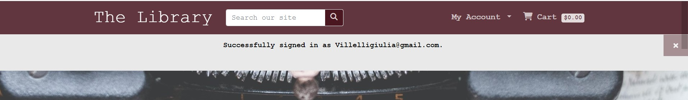

# The Library

The Library, a Heroku-hosted e-commerce platform, is an online bookstore dedicated to the world of reading. Designed for book lovers and avid readers, this responsive website provides a diverse collection of books across genres and authors, fostering literary exploration and discovery. Within its virtual shelves, users can engage with books through detailed descriptions, ratings, and reviews, creating a sense of community among readers. Seamlessly integrated with a user-friendly shopping experience, The Library offers best offers and bestsellers for discerning readers. Behind the scenes, an admin dashboard empowers efficient library management. With a newsletter subscription section and a link to a dedicated Facebook page, The Library aims to connect and engage its audience. It is a literary hub, welcoming all who cherish the written word to embark on a journey of literary delight.

[Here](https://the--library-3ca77daf8ee2.herokuapp.com/) is a live view of the project.

## Features

The Library is an online bookstore designed for ease and efficiency. The landing page, like a virtual bookshelves offers a wide range of books for users to explore. Users can easily filter books by title, category, or author, simplifying the search process. The site features two navigation bars: one for essential functions like a search bar.  account management, including registration, login and access to profile, where user can store profile info available for future checkout;  library management section for admin user only, providing administrators with book-related tasks like adding, editing, and deleting books.It also includes a cart where users can add book to it, review order and costs,continue shopping or proceed with the checkout process. The second navbar offers sections for all books, categories, and best sellers, including special offers. Additionally, links to a Facebook page and a newsletter subscription combining user-friendly exploration with convenience.The website comes also with a customized 404 page where the user gets redirected to if by any reason ends up on an inexistent page within the web si and that guides the user in an easy way to go back to the main page"

### Navbars and footer

The navigation bars and footer provide a consistent presence across almost every page of the website. This design choice ensures a seamless and user-friendly experience, allowing easy access to essential features. Users will find these elements consistently available throughout the site, except on pages related to the authentication process and the 404 error page, maintaining a sense of familiarity and ease of navigation."

 

- The first nav bar is placed on top of the page. It consist of :
  - - "The Library" link : title and name of the bookstore, is a linkable heading which redirects to the main page when clicked.
  - - Main search bar: the user will be able to filter the books in the library. By entering keywords such as book titles, author names, or categories, users can conduct detailed searches, simplifying the process of finding their desired content. The search bar efficiently retrieves search results, presenting users with relevant books, or when necessary, informative messages, guiding users when there are no matching results or invalid inputs.
  - - "My Account" dropdown link : in this section, the user will have access to authentication system. If logged out or unregistered, the "Login" and "Register" link will be displayed. Although the user would be able to navigate the site, searching for books, or looking for book details, best offers, best sellers, adding books to cart etc, withouth being authenticated, the user will be asked to do so to access more usefull and advanced features such as proceed with the checkout process, leaving book reviews and access to user profile info, where the user could store iformation details for future checkout. The Profile will be then shown in the "My Account" dropdown when the user is logged in. If logged in a "Library Management" link will be also displayed in this section, with the additional condition of the user being admin of the website. The "Library Management" link will give access to an admin-like page, where whoever has access to it, will have direct control of the Library and be able to perform actions such as create a new book, edit or delete an exiting one.

  - - Cart : the Cart link will be found on the top right hand side of the navbar, together with a cart icon and the dollar amount of the cart content.

  - - Placed below the main nav bar, the second navbar is about book related section. It consists of three links placed in the center of the width of the navbar:
    - - - All Books : ie the landing page, a virtual bookshelve , where the user has visibility of all the books of the library.
    - - - All Categories: here the user will see all the books grouped by category.
    - - - Best Seller : in this section the user will be able to see Best offers books ie books with lowest price among the Library and the Best sellers, which are the books with the highest rating.

  - - On responsive devices the two navbars collapse into 2 different dropdown menu,represented by an info icon for the main nav bar and a book icon for the second one.

- The footer is a concise yet valuable section that includes two significant elements. Firstly, it provides users with a direct link to ['The Library's []](https://www.facebook.com/profile.php?id=61551466252534)official Facebook page, enhancing the platform's social engagement. Secondly, it features a user-friendly newsletter subscription mechanism, seamlessly integrated with [Mailchimp](https://mailchimp.com/), enabling readers to subscribe for updates and exclusive offers.

### Book list landing page

- The Book List Page serves as the landing point for users, a virtual bookshelf. Upon arrival, users are greeted with a introductory image of a typewriter, which encapsulates the website's theme also seen in the typewriting effect for all displayed messages throughout the website navigation. This page presents a diverse collection of books across various categories. Each book is showcased with its cover image, accompanied by essential details such as category, price, and rating. To explore a book further, users can click the 'View Book Details' button and navigate to dedicated page for more details about the selcted book."

### The Book Detail Page

- This page opens up a wealth of information for users once they click the 'View Book Details' button. Here, they can delve into the specifics of a book, including its title, author, cover image, category, price, rating, and a detailed description. For those logged in, the page also offers the opportunity to submit a review, contributing to the community's collective insights. Additionally, users can effortlessly add the book to their cart, selecting the desired quantity.

### All Categories

- On this page are displayed all categories available in the bookstore. Every category is rapresented by a cover image, that resembles the cover image of a book, with the name of the category on it. By clicking on top of each book category the user will be shown all books grouped by the selected category. The same result could be also achieved by typing the category name in the search bar.
  
  

### Best Sellers

- This page is designed to captivate users with enticing book offers. It features a dynamic carousel showcasing the more convient deals, complete with book covers and prices. These irresistible offers are meticulously selected, presenting users with the lowest-priced books in the library. Below, users can explore the most popular books, neatly categorized by their ratings.
-

### The cart

The Cart is an essential element of TheL
library's e-commerce experience. Once users have made their book selections, they are neatly organized in the cart. As previously mentioned, the cart's total is conveniently displayed alongside the cart icon in the navigation bar, ensuring transparency for users. By clicking on the cart icon, users gain access to a detailed cart view that includes an order summary. This summary comprises essential information such as the book's title (linked to its respective detail page for easy reference), a bin icon for book removal, the quantity of selected books, individual book prices, additional costs like delivery charges, and the grand total. Two  links are presented: 'Proceed to Checkout' to initiate the purchase process and 'Go to Library' to continue shopping.

## The Checkout

The Checkout feature is designed to streamline the purchasing process while ensuring the security of user information. As per other advanced services,  to initiate checkout, users are prompted to either log in or register an account. Once on the checkout page, users encounter an Order Summary, providing a comprehensive overview of their selections. Next to this summary, an intuitive checkout form awaits user input, requiring essential details for a successful transaction. Users are presented with the convenient option to 'Save to Profile,' enabling the storage of key information for future checkouts.
To ensure  security and efficiency, the payment process has been integrated using  [Stripe](https://stripe.com/docs/payments/accept-a-payment#web-collect-card-details) for secure payment processing. The user receives immediate feedback should the card details be incorrect or omitted. Upon successful submission of the form, an overlay spinner indicates processing, and users are seamlessly redirected to an 'Order Successful' page. Here, they receive confirmation of their order, including an order number, along with the assurance that an email containing order details will be sent to the provided email address.

## Profile and Edit Profile

The Profile app takes center stage in enhancing user experience and order management. Located under the "My Account" section, users can set up and store and their personal information which will then be used for any future checkout. This ensures a seamless checkout process, with personal information readily available. Furthermore, users have the option to save this data to their profile, during the checkout processby checking the "SAve to profile" boc significantly simplifying future transactions. Should the need arise to modify their information, users can easily do so through the "Edit Profile" link, with updates reflected during subsequent checkouts. To further assist users, the app includes an order history feature, empowering them to track past purchases effortlessly.

## Library management

The Library Management app, is perhaps the most powerfull feature of the project,as it empowers authorized users with comprehensive control over our virtual library. To access this  management tool, users must not only be authenticated but also granted superuser privileges. The Library Management interface resembles the familiar layout of the book list page, with one key distinction: it offers an array of powerful administrative actions, such as "create a new book" allowing users to add entirely new books to the library collection . Below, all existing books are listed, each accompanied by two additional buttons: "Edit Book" and "Delete Book." These buttons enable superusers to make instant modifications or remove books from the library. To facilitate efficient management, the Library Management app also integrates a search bar, offering administrators quick access to the books they wish to oversee. Through this intuitive tool, the site aims to provide  superusers with the means to curate and maintain the virtual Library.

### Library Management CRUD funcionality

- Create New Book

  - - Placed in the top center of the page the "Create New Book" button allows the user to populate the library by introducing entirely new book entries. This feature empowers administrators with the capability to increase the collection, on the model adopted by the other books. Admins can specify essential details for each new addition, including the book's title, a descriptive overview, optionally a cover image, where for added convenience, in the absence of a selected cover image, a default one will be automatically assigned. Furthermore, administrators can specify the book's rating and price. Upon creation, the new book integrates into the  library, enriching the library bookshelve.

- Edit book :

  - - Within the Library Management interface, the "Edit Book" function grants administrators the power to refine and enhance existing entries in the library. This feature enables users to make selective modifications to certain attributes of a book, including its description, price, ratings, and cover image. However, it's important to note that the foundational details of a book, such as its title and author, remain unaltered to maintain accuracy and consistency within our collection. This flexibility ensures that our library evolves, reflecting the latest information and providing our readers with the most up-to-date details about their favorite literary works.

- Delete book :

  - -  With this option the admin of the Library will be able to permanetly remove a book from the collection.

- Authentication :

  - - Authentication is at the core of The Library project, utilizing the Django Allauth system to ensure user accounts are not only secure but also accessible. To unlock the full spectrum of the project's functionality, users are required to log in or register for an account. This process is fortified by email verification, bolstering the security of user data. After successfully logging in or registering, users will receive a confirmation email. Upon confirming this email, they gain active access to the features and capabilities the library has to offer.
Each page for authentication has been customized to keep consintency with the overall structure of the project.

## Messages

- Messages are displayed throughout our application, enriching the user experience and streamlining site navigation. They serve as informative cues, keeping users well informed about every action they take. These messages, designed with user-friendliness in mind, fade away after 17 seconds or can be conveniently dismissed with a simple "x" button. To align with the project's theme, messages are introduced with a typewriting effect. This not only maintains consistency with our project's style but also elevates the overall user experience

## The Site Goal 

The primary goal of the library website is to provide a comprehensive and user-friendly online platform for book enthusiasts and reading lovers. It serves as a virtual and always accessible libray for discovering, exploring, and purchasing a wide variety of books across various categories and genres providing a pleasant and easy online shopping experience for all book enthusiasts.

Through an intuitive and engaging interface, the website aims to:
-  Facilitate Book Discovery: The site's virtual bookshelves, search cuncionality, and categorization features make it effortless for users to discover new authors, genres, and hidden literary gems.
- Simplify Library Management: For administrators and super users, the website's Library Management feature make really easy  the process of adding, editing, and deleting books, ensuring that the virtual library remains up-to-date and organized.
- Promote Reading Culture: Ultimately, the library website's overarching goal is to promote a culture of reading and literary exploration. 

## Epics

For the development of the project, 20 Epics with 20 User Stories were created. Details of the Agile Design Thinking approach can be found in the project Kanban board [here](https://github.com/users/Villelligiulia/projects/7)

1# Book List/ must-have label
 Library Mvp : Essential Features
 
#2 Book Details/ must-have label
 Library Mvp : Essential Features

#3 Category Exploration/ could have label

#4 Discover Best Sellers/ could have label

#5 User Story 5: Manage Cart/ must-have label
 Library Mvp : Essential Features

#6 User Story 6: User Registration, Login, Logout, and Email Verification/ must-have label
 Library Mvp : Essential Features

#7 User Story 7: Checkout Process/ must-have label
 Library Mvp : Essential Features

#8 User Story 8: Successful Checkout and Email Notification must-have

#9 User Story 9: User Profile and Edit Profile /could have label

#10 User Story 10: Library Management - Add - Super User /could have label

#11 User Story 11: Library Management - Edit - Super User/ could have label

#12 User Story 12: Library Management - Delete - Super User/ could have label

#13 User Story 13: Search Functionality in Library Management/ shoul have label

#14 User Story 14: Custom 404 Page shoul have label

#15 User Story 15: Add Social Media Link in the Footer/ could have wont have label

#16 User Story 16: Newsletter Subscription/ could have wont have label

#17 User Story 17: Reader's Community Blog/ could have wont have label 

#18 User Story 18: Promotional Discounts and Coupons/ could have wont have label

#19 User Story 19: Author Pages/ could have wont have label

#20 User Story 20: Book Previews or Sample Chapters/ could have wont have

## User Stories and Mvp Prioritaziotion

- For each Epic, one User Story has been developed for a total of 20 User Stories. Each story was assigned a label of Must-Have, Should-Have, Could-Have or Won't Have. Out of those Epics and respective User Stories, 17 were completed and implemented of which 6 with "must have" label, assigned to "Library Mvp : Essential Features" that provides core functionlity and essential Library component , 8 with a "could have" label and and 1 with "should have" label providing additional elements and increasing the overall user experience. Individual user stories were categorised according to whether they had to be implemented to produce a Minimum Viable Product , with priority for development to be given to those that were part of the MVP specification.

- The development of the library website has followed a structured approach, with a clear focus on implementing essential features first to create a Minimum Viable Product (MVP). These essential features, labeled as "must-have," were prioritized to ensure that the core functionality of the website is in place and provides a solid foundation for users.

- The labels "should have" and "could have" were carefully chosen to categorize additional features based on their importance and their potential to enhance the user experience. "Should have" features, while not essential for the MVP, are considered functionality-related and provide valuable capabilities to users. On the other hand, "could have" features, while not essential, are focused on further improving the user experience and adding extra value to the website.

- This prioritization approach ensures that the library website meets its fundamental goals, such as book discovery, user registration and checkout,search funcionality  before delving into additional enhancements like social media integration, newsletter subscriptions, and a reader's community blog. By following this strategy, it has been possible to deliver a  functional  product while leaving room for future improvements that will enrich the user experience and community engagement.

## Impleented Used Stories and Feature Features

-The first 16 user stories have been successfully implemented to create the core functionality of the library website. Here's a brief overview of their implementation:

- - Book List (Must-Have): The landing page of the website functions as a virtual bookshelf, displaying a wide range of books across various categories. Users can easily navigate and explore the library's collection.

- - Book Details (Must-Have): Clicking on a book's "View Details" button opens a dedicated page displaying essential information about the book, including its title, author, cover image, category, price, rating, and a detailed description.

- Category Exploration (Could Have): Users can filter books by category, improving navigation and helping readers find specific genres of interest.

- Discover Best Sellers (Could Have): The website showcases best-selling books, making it easier for users to discover popular titles and offers.

- Manage Cart (Must-Have): Users can add books to their cart for purchase, view the cart's content, and proceed to checkout. The cart's total price is displayed alongside the cart icon for convenience.

- Search Functionality (Must have): A search bar is available for library management, making it easier for superusers to find specific books for editing or deletion.

- User Registration, Login, Logout, and Email Verification (Must-Have): Users can create accounts, log in, log out, and verify their email addresses. These features enhance user engagement and provide a secure login system.

- Checkout Process (Must-Have): A user-friendly checkout process allows users to review their order, provide essential details, and make payments.

- Successful Checkout and Email Notification (Must-Have): Users receive confirmation of successful orders, including order numbers and email notifications with purchase details.

- User Profile and Edit Profile (Could Have): Users can set up and edit personal information, streamlining the checkout process and enhancing the user experience.

- Library Management - Add - Super User (Could Have): Superusers can add new books to the library, expanding the collection.

- Library Management - Edit - Super User (Could Have): Superusers can modify book details, such as descriptions, prices, ratings, and cover images.

- Library Management - Delete - Super User (Could Have): Superusers can remove books from the library, ensuring content relevance.

Custom 404 Page (Should Have): A custom error page provides a better user experience in case of broken links or unavailable content.

Add Social Media Link in the Footer (Could Have): A link to the library's Facebook page has been added to the website footer, facilitating social media engagement.

Newsletter Subscription (Could Have): Users can subscribe to newsletters to stay updated with library news and promotions.

These implemented features establish the library website's core functionality, ensuring users can explore, select,search  and purchase books while enjoying a seamless user experience. The remaining "could have" and "should have" features will be considered for future enhancements to further improve the website's capabilities and user engagement.

## Wireframe Design and Styling Approach

- The wireframe of the project,was developed using [Balsamiq](https://balsamiq.cloud/srbtn91/p1u93z6/r945A), that contributed to create the initial layout and structure of the website.
With its simple and effective wireframing capabilities, not only helped visualize the structural layout of the library website but also played a significant role in inspiring the typewriting effect and the overall bookish atmosphere that defines the platform and enabled the creation of wireframes that illustrated how books would be displayed, including book covers, categories, prices, and ratings.
The planning stage served as a foundation for the subsequent design and development phases, ensuring that the library website became more than just an online bookstore– as the bookish atmosphere with the images, the style, the font and the effects became integrating part of the design.

  

